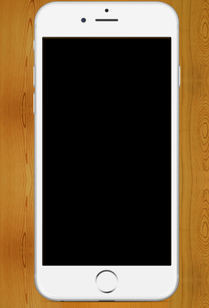

# 模拟IOS系统 

> 模拟苹果手机交互行为及其渲染样式
> 组件之间的通信机制是`callback`

## 暂时交互效果

``` html
1. 开启程序，呈现黑屏效果
2. 可以点击HOME键表示打开手机
3. 输入密码(紧急情况不支持)
4. 通过双击(模拟移动端长按事件)app图标，呈现是否删除app(暂不支持)
5. 可拖拽黑点(后期加入范围监测，尽量和IOS效果统一)
```

---

## 接下来要完成的功能

``` html
1. 可拖拽app图标，并可以分组
2. 加入锁屏效果
3. 可以删除App
4. 加入自动截图功能(更好地展示毛玻璃效果)
5. 解锁密码次数限制
```

---

## 下来看看？

``` shell
$ git clone git@github.com:maczyt/analog-ios-system.git
$ cd analog-ios-system
$ npm install
$ npm start
```

## 效果图




